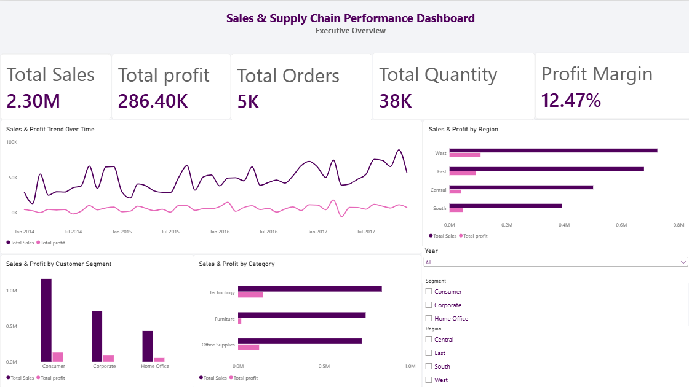
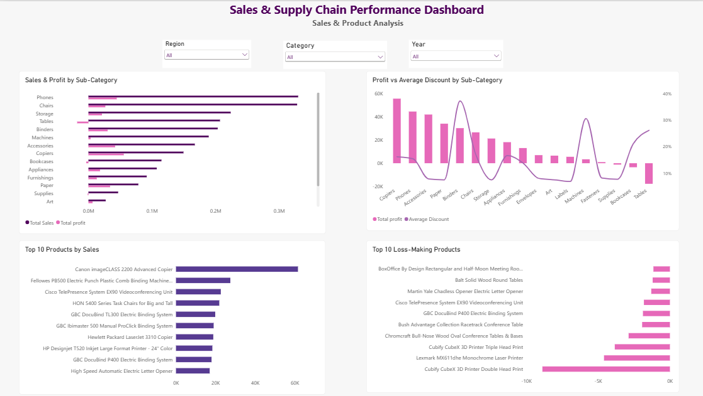
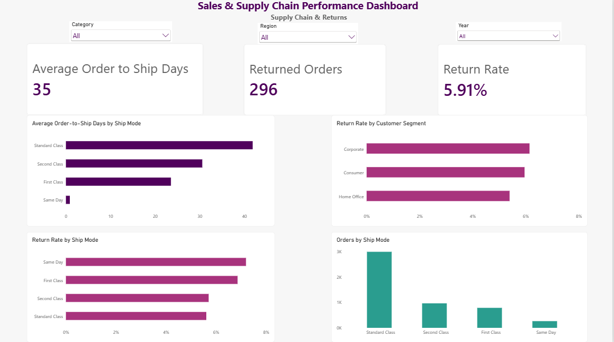

# Sales & Supply Chain Performance Analysis

## Project Overview
This project analyzes retail sales and supply chain data to evaluate sales performance, profitability, customer segments, product performance, returns, and shipping operations.

The goal is to transform raw transactional data into actionable business insights that can support data-driven decision-making.

## Business Problem
The company needs a comprehensive view of its sales and profitability performance to identify underperforming and high-performing products, customer segments, and geographic markets.

The analysis also investigates discount patterns, returns, and shipping operations to identify potential improvement opportunities.

## Tools & Skills
- Power BI
- Power Query
- DAX
- Data Cleaning & Transformation
- Data Modeling
- Data Visualization
- Business Analysis

## Data Preparation
The dataset contains 9,994 order-line records.

Data preparation included:
- Reviewing missing values and errors
- Validating data types
- Checking date consistency
- Checking Category/Sub-Category consistency
- Reviewing duplicate records based on the dataset grain
- Trimming text fields
- Creating an Order-to-Ship Days field
- Creating and validating the relationship between the sales data and calendar table

Each row represents a product line within an order, so distinct Order IDs were used when calculating order-level KPIs.

## Data Model
A calendar table was connected to the sales dataset using Order Date in a one-to-many relationship, enabling time-based analysis.

## Key KPIs
The dashboard tracks:
- Total Sales
- Total Profit
- Total Orders
- Total Quantity
- Profit Margin
- Average Discount
- Average Order-to-Ship Days
- Returned Orders
- Return Rate

## Dashboard

### 1. Executive Overview
Provides a high-level view of sales, profitability, regional performance, customer segments, categories, and trends over time.

### 2. Sales & Product Analysis
Analyzes sub-category and product performance, including top-selling products, loss-making products, and discount/profit patterns.

### 3. Supply Chain & Returns
Analyzes order-to-ship time, shipping modes, order volumes, and return patterns across shipping modes and customer segments.

## Key Insights
- The West region generated the highest sales and profit among all regions.
- The Consumer segment generated the highest sales and profit among customer segments.
- Technology was the leading category in both sales and profitability.
- Sales showed an overall upward direction in later periods, while profit remained more volatile.
- Phones generated the highest sales among sub-categories, while Tables recorded an overall loss.
- Higher average discounts were not consistently associated with lower profits across all sub-categories.
- Same Day had the highest return rate among shipping modes, while Standard Class handled the largest order volume.
- Corporate had the highest return rate among customer segments.

## Business Recommendations
- Investigate the loss-making Tables sub-category by analyzing profitability across products, discount levels, and regions before changing the discount strategy.
- Investigate the higher return rate associated with Same Day shipping by identifying the products and regions contributing most to these returns.
- Analyze the product and customer segment mix driving the strong performance of the West region and assess whether successful patterns can be replicated in lower-performing regions.
- Investigate why profit growth is not keeping pace with sales by analyzing changes in discount levels and product mix over time. Additional cost data would enable deeper profitability analysis.

## Data Limitations
The dataset does not include delivery dates, return reasons, detailed cost components, or inventory levels. Therefore, the analysis avoids attributing returns or profitability changes to specific causes without supporting data.
